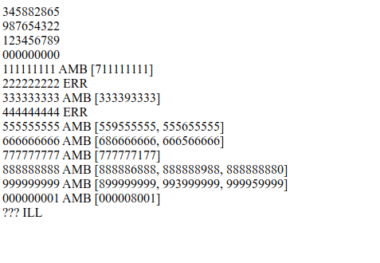
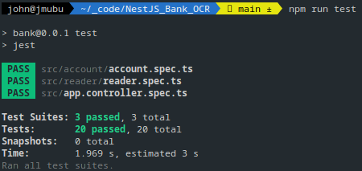

# [ Bank OCR Problem](https://codingdojo.org/kata/BankOCR) in NestJS

## Description
<strong>Quckly done for an interview.

I do see many places to improve, but only talked to someone for 30 mins... </strong>

[Node.js](https://nodejs.org) v21.5.0

[TypeScript](https://www.typescriptlang.org/)

[Nest framework](https://github.com/nestjs/nest)

 [Bank OCR Problem](https://codingdojo.org/kata/BankOCR)

## Installation

```bash
$ npm install
```

## Running the app

```bash
# development
$ npm run start

# watch mode
$ npm run start:dev

# production mode
$ npm run start:prod
```
[Open the running project and preview the output or run tests](http://localhost:3000/ocr)



## Test

```bash
# unit tests
$ npm run test

# e2e tests
$ npm run test:e2e

# test coverage
$ npm run test:cov
```


# Kata Bank OCR

Description [available on
codingdojo.org](https://codingdojo.org/kata/BankOCR/).

The following sections briefly describe the features to be supported.

## Parsing Account Numbers

Given a string of characters representing an account number
When I run the OCR parser
Then I should have a numeric representation of the account number

In this scenario, account numbers will be provided as a 3- or 4-line string of
characters, using spaces, pipes & underscores (the 4th line, if provided, will
be blank).

So, given the following example input...

```
    _  _     _  _  _  _  _
  | _| _||_||_ |_   ||_||_|
  ||_  _|  | _||_|  ||_| _|

```

The output should be `123456789`.

## Validating Account Numbers

Given a string of characters representing an account number
When I run the OCR parser
Then the output should have a valid checksum

Checksum should be calculated as follows:

account number:   3  4  5  8  8  2  8  6  5
position names:  d9 d8 d7 d6 d5 d4 d3 d2 d1

`(d1+2*d2+3*d3 +..+9*d9) mod 11 = 0`

## Outputting to a Report

Given an input file of up to 500 account number strings
When I run the OCR parser
Then I should have an output file containing 1 line per processed account number
And any illegible digits should be replaced by "?"
And any account number containing illegible digits should be followed by "ILL"
And any account number failing checksum validation should be followed by "ERR"

So, an example of the output file might read as follows:

```
457508000
664371495 ERR
86110??36 ILL
```

## Guessing illegible & invalid account numbers

Given an account number with illegible digits or an invalid checksum
And a valid checksum can be obtained by adding or removing at most a single pipe or underscore character to each input digit
When I run the OCR parser
Then I should have a numeric representation of the account number

Given an account number with illegible digits or an invalid checksum
And a valid checksum can be obtained in multiple ways by adding or removing at most a single pipe or underscore character to each input digit
When I run the OCR parser
Then the result should be marked with "AMB"

Given an account number with illegible digits or an invalid checksum
And a valid checksum cannot be obtained by adding or removing at most a single pipe or underscore character to each input digit
When I run the OCR parser
Then the result should be marked with "ILL" or "ERR"

